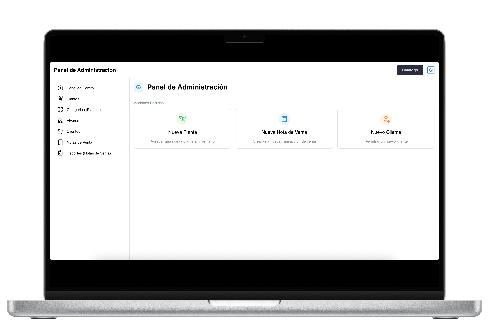
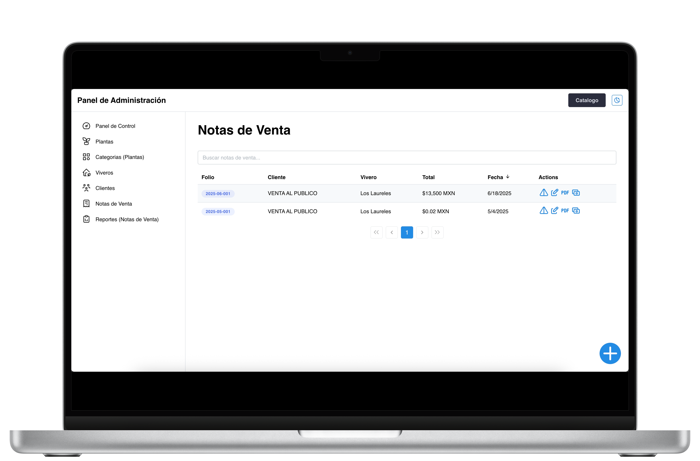

# 🌱 Nursery Management System

A complete web-based platform for managing plant inventories, customer relationships, and sales across multiple nursery locations. Designed to support both internal staff operations and a public-facing plant catalog.


---

## 🚀 Features

- 📦 **Plant Inventory Management**: Add, update, and organize plants by categories and availability.
- 🛒 **Sales & Transactions**: Track purchases across locations with dynamic sales reporting.
- 🧾 **Customer Management**: View history, preferences, and buying behavior.
- 🗺️ **Multi-location Support**: Manage several nursery branches from one dashboard.
- 🌐 **Public Catalog**: Share plant collections online with search and filter capabilities.
- 📊 **Reports & Analytics**: Sales trends and performance dashboards.

---

## 🛠️ Technologies Used

- **Frontend**: TypeScript, HTML, CSS
- **Framework**: Web Components / Vanilla JS
- **UI**: Responsive Design with CSS Grid & Flexbox
- **Architecture**: Modular Web Platform structure
- **Tools**: Git, VS Code, Figma (for mockups)

---

## 📸 Screenshots

### 📦 Plant Inventory Dashboard


### 🛒 Sales Overview


### 🌱 Public Plant Catalog


---

## 🧪 How to Run Locally

```bash
# Clone the repo
git clone https://github.com/tu-usuario/nursery-management-system.git

# Navigate to the project folder
cd nursery-management-system

# Install dependencies
yarn install

# Start the development server (both API and Web sides)
yarn rw dev

